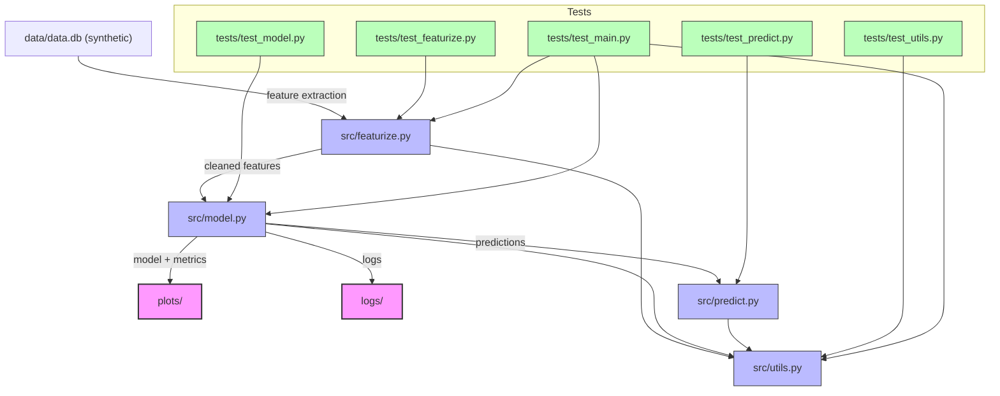

# tabular-ml-pipeline

A modular, production-ready ML pipeline for tabular (synthetic) healthcare data, with a focus on recall optimization for rare event prediction.

**License: MIT. No company IP or proprietary data.**

- **src/** — Modular pipeline code (feature engineering, modeling, evaluation, utils).
- **data/** — Synthetic example data (generated by `scripts/generate_synthetic_db.py`).
- **tests/** — Unit and integration tests.

## Architecture



All data is synthetic. No company IP or proprietary data is present.

## Quickstart

```sh
cd tabular-ml-pipeline
poetry install
python scripts/generate_synthetic_db.py  # Generate synthetic data.db
poetry run python -m src.main
```

## Usage

### 1. Generate synthetic data

Run the following to create a fresh synthetic database:

```sh
python scripts/generate_synthetic_db.py
```

### 2. Run the pipeline (script mode)

```sh
poetry run python -m src.main
# Or with custom output/model/log locations:
poetry run python -m src.main --db-path data/data.db --model rf --output-dir plots/ --log-dir logs/
```
- Outputs (plots) are saved to the specified directory (default: `plots/`).
- Logs are saved to the specified directory (default: `logs/`).

### 2. Inspect results
- Plots and logs are available in the output and log directories after running the pipeline.
- Data is synthetic and included in `data/data.db`.

## Project Highlights
- Modular, extensible codebase
- Robust feature engineering and preprocessing
- Model training, evaluation, and threshold tuning for recall optimization
- Full test suite and reproducible environment

## About the Data
This project uses synthetic dental healthcare data for demonstration. The pipeline is general-purpose and can be adapted to other tabular datasets.

## Author
[parrenthesis](https://github.com/parrenthesis)

## Testing

Run the full test suite with:

```sh
poetry run python -m pytest --disable-warnings -v
```

All tests should pass. Test output and coverage are managed by pytest and plugins.

## Cleaning the Workspace

Remove all build artifacts, logs, plots, and caches with:

```sh
make clean
```

This will reset the workspace to a clean state.
